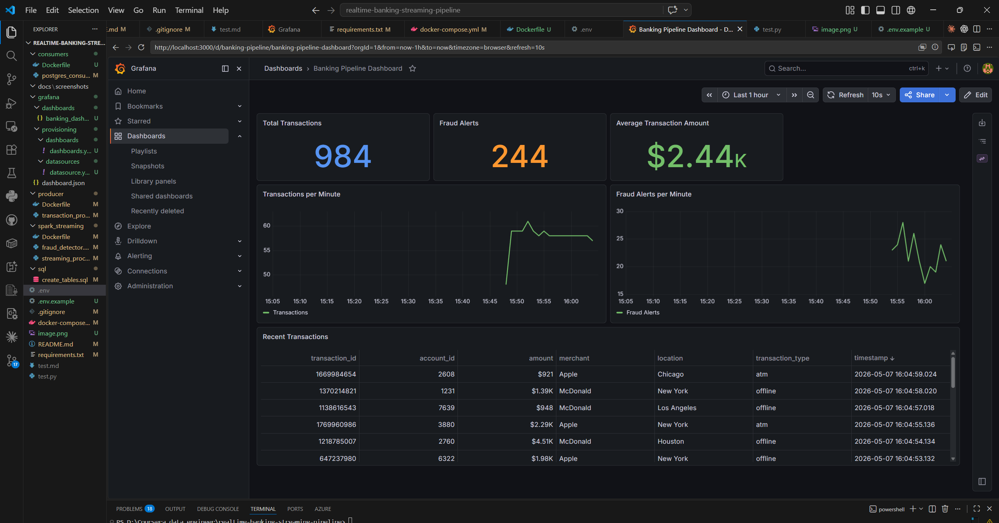

# Real-Time Banking Streaming Pipeline


A production-ready, end-to-end streaming data pipeline that processes real-time banking transactions, detects fraud using Apache Spark, and visualizes metrics through a live Grafana dashboard — all orchestrated with Docker Compose.

---

## Table of Contents

- [Architecture](#architecture)
- [Tech Stack](#tech-stack)
- [Features](#features)
- [Screenshots](#screenshots)
- [Project Structure](#project-structure)
- [Getting Started](#getting-started)
- [Configuration](#configuration)
- [Monitoring](#monitoring)
- [Database Schema](#database-schema)
- [End-to-End Testing](#end-to-end-testing)

---

## Architecture

```
┌──────────────────────┐
│  Transaction         │  Generates 1 transaction/sec
│  Producer (Python)   │  with randomized banking data
└──────────┬───────────┘
           │ publishes to
           ▼
┌──────────────────────┐
│   Apache Kafka       │  Topic: transactions
│   (Confluent 7.4)    │  Broker: kafka:9092
└──────────┬───────────┘
           │
     ┌─────┴──────┐
     │            │
     ▼            ▼
┌─────────┐  ┌──────────────────┐
│Postgres │  │  Fraud Detector  │  Spark Structured
│Consumer │  │  (PySpark 3.4)   │  Streaming + JDBC
└────┬────┘  └────────┬─────────┘
     │                │
     └──────┬─────────┘
            ▼
┌───────────────────────┐
│     PostgreSQL 13     │
│  ┌─────────────────┐  │
│  │  transactions   │  │
│  ├─────────────────┤  │
│  │  fraud_alerts   │  │
│  └─────────────────┘  │
└───────────┬───────────┘
            │
            ▼
┌───────────────────────┐
│       Grafana         │  Live dashboard, auto-refresh 10s
│   localhost:3000      │
└───────────────────────┘
```

---

## Tech Stack

| Layer | Technology | Version | Role |
|---|---|---|---|
| Messaging | Apache Kafka (Confluent) | 7.4.0 | Event streaming backbone |
| Stream Processing | Apache Spark (PySpark) | 3.4.0 | Fraud detection engine |
| Storage | PostgreSQL | 13 | Persistent transaction store |
| Ingestion | Python (kafka-python) | 2.x | Kafka producer & consumer |
| Visualization | Grafana | Latest | Real-time dashboards |
| Orchestration | Docker Compose | v2 | Multi-container deployment |

---

## Features

- **Real-time ingestion** — 1 transaction/second through Kafka with configurable rate
- **Fraud detection** — Spark Structured Streaming flags transactions above configurable thresholds
- **Dual alert levels** — "Suspicious" (> $3,000) and "High Value" (> $4,000)
- **Live dashboard** — Grafana auto-refreshes every 10 seconds with 6 metric panels
- **Production-ready patterns** — Health checks, retry logic (30 attempts), graceful shutdown
- **12-factor config** — All secrets and parameters externalized via environment variables
- **Zero collision IDs** — Transaction IDs drawn from a 2-billion-value space

---

## Screenshots

### Grafana Dashboard — Live Transactions


<!-- ### Transactions & Fraud Alerts Over Time


### All Services Healthy


### PostgreSQL — Transaction Data
 -->

> **Note:** Add your own screenshots to `docs/screenshots/` by running the pipeline and capturing the UI.

---

## Project Structure

```
realtime-banking-streaming-pipeline/
│
├── producer/
│   ├── Dockerfile
│   └── transaction_producer.py     # Kafka producer — generates fake transactions
│
├── consumers/
│   ├── Dockerfile
│   └── postgres_consumer.py        # Kafka consumer — writes to PostgreSQL
│
├── spark_streaming/
│   ├── Dockerfile
│   ├── fraud_detector.py           # Spark Structured Streaming fraud detection
│   └── streaming_processor.py     # Debug processor (prints to console)
│
├── sql/
│   └── create_tables.sql           # PostgreSQL schema (transactions + fraud_alerts)
│
├── grafana/
│   ├── dashboards/
│   │   └── banking_dashboard.json  # Pre-built Grafana dashboard
│   └── provisioning/
│       ├── datasources/
│       │   └── datasource.yaml     # Auto-provisioned PostgreSQL datasource
│       └── dashboards/
│           └── dashboards.yaml     # Dashboard provider config
│
├── docker-compose.yml              # Full stack orchestration
├── requirements.txt                # Python dependencies
├── .env.example                    # Environment variable template
└── README.md
```

---

## Getting Started

### Prerequisites

- [Docker](https://docs.docker.com/get-docker/) & Docker Compose v2
- 4 GB RAM available for Docker

### 1. Clone the repository

```bash
git clone https://github.com/bachir00/realtime-banking-streaming-pipeline.git
cd realtime-banking-streaming-pipeline
```

### 2. Configure environment variables

```bash
cp .env.example .env
# Edit .env with your values (defaults work out of the box)
```

### 3. Start the full stack

```bash
docker-compose up --build -d
```

### 4. Verify all services are running

```bash
docker-compose ps
```

Expected output — all services `running`, Kafka and PostgreSQL showing `(healthy)`:

```
NAME                          STATUS
...kafka-1                    Up (healthy)
...postgres-1                 Up (healthy)
...producer-1                 Up
...postgres-consumer-1        Up
...fraud-detector-1           Up
...grafana-1                  Up
...zookeeper-1                Up (healthy)
```

### 5. Open the dashboard

Go to [http://localhost:3000](http://localhost:3000) — login: `admin` / `admin`

Navigate to **Dashboards → Banking Pipeline Dashboard**.

### 6. Stop the stack

```bash
docker-compose down -v   # -v removes volumes (full reset)
```

---

## Configuration

All parameters are controlled via environment variables. Copy `.env.example` to `.env` and adjust as needed.

| Variable | Default | Description |
|---|---|---|
| `KAFKA_BROKERS` | `localhost:9092` | Kafka broker address (use `kafka:9092` in Docker) |
| `KAFKA_TOPIC` | `transactions` | Kafka topic name |
| `KAFKA_GROUP_ID` | `postgres-consumer-group` | Consumer group ID |
| `KAFKA_AUTO_OFFSET_RESET` | `latest` | `latest` or `earliest` |
| `DB_HOST` | `localhost` | PostgreSQL host |
| `DB_PORT` | `5432` | PostgreSQL port |
| `DB_NAME` | `banking_db` | Database name |
| `DB_USER` | `postgres` | Database user |
| `DB_PASSWORD` | `password` | Database password |
| `TRANSACTION_INTERVAL_SEC` | `1` | Seconds between generated transactions |
| `FRAUD_AMOUNT_THRESHOLD` | `3000` | Amount above which a transaction is suspicious |
| `HIGH_VALUE_THRESHOLD` | `4000` | Amount above which a transaction is high-value |

**Example — increase transaction rate and lower fraud threshold:**

```bash
TRANSACTION_INTERVAL_SEC=0.5 FRAUD_AMOUNT_THRESHOLD=1000 docker-compose up -d
```

---

## Monitoring

### Check producer output

```bash
docker-compose logs producer --tail=20
```

### Check consumer throughput

```bash
docker-compose logs postgres-consumer --tail=20
```

### Check fraud detector

```bash
docker-compose logs fraud-detector --tail=30
```

### Query the database directly

```bash
# Transaction count and time range
docker exec -it realtime-banking-streaming-pipeline-postgres-1 \
  psql -U postgres -d banking_db \
  -c "SELECT COUNT(*), MIN(timestamp), MAX(timestamp) FROM transactions;"

# Latest fraud alerts
docker exec -it realtime-banking-streaming-pipeline-postgres-1 \
  psql -U postgres -d banking_db \
  -c "SELECT * FROM fraud_alerts ORDER BY alert_timestamp DESC LIMIT 10;"

# Top merchants by volume
docker exec -it realtime-banking-streaming-pipeline-postgres-1 \
  psql -U postgres -d banking_db \
  -c "SELECT merchant, COUNT(*) AS txn_count, ROUND(AVG(amount)::numeric, 2) AS avg_amount FROM transactions GROUP BY merchant ORDER BY txn_count DESC;"
```

---

## Database Schema

```sql
-- Stores all incoming transactions
CREATE TABLE transactions (
    id               SERIAL PRIMARY KEY,
    transaction_id   INTEGER UNIQUE NOT NULL,
    account_id       INTEGER NOT NULL,
    amount           DECIMAL(10, 2) NOT NULL,
    merchant         VARCHAR(100) NOT NULL,
    timestamp        TIMESTAMP NOT NULL,
    location         VARCHAR(100),
    transaction_type VARCHAR(20),
    created_at       TIMESTAMP DEFAULT CURRENT_TIMESTAMP
);

-- Stores fraud alerts generated by Spark
CREATE TABLE fraud_alerts (
    id               SERIAL PRIMARY KEY,
    transaction_id   INTEGER NOT NULL REFERENCES transactions(transaction_id),
    account_id       INTEGER NOT NULL,
    amount           DECIMAL(10, 2),
    alert_reason     VARCHAR(255),
    alert_timestamp  TIMESTAMP DEFAULT CURRENT_TIMESTAMP
);
```

---

## End-to-End Testing

| Step | Command | Expected Result |
|---|---|---|
| 1. Start stack | `docker-compose up --build -d` | All services running |
| 2. Producer logs | `docker-compose logs producer` | `✓ N transactions produites` |
| 3. Consumer logs | `docker-compose logs postgres-consumer` | `✓ Saved N transactions total` |
| 4. Count transactions | `SELECT COUNT(*) FROM transactions` | Increasing every second |
| 5. Count fraud alerts | `SELECT COUNT(*) FROM fraud_alerts` | ~30% of transactions |
| 6. Grafana dashboard | [localhost:3000](http://localhost:3000) | Live metrics visible |
